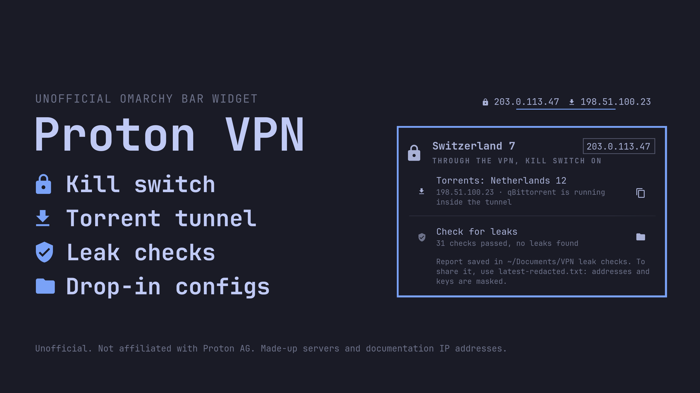
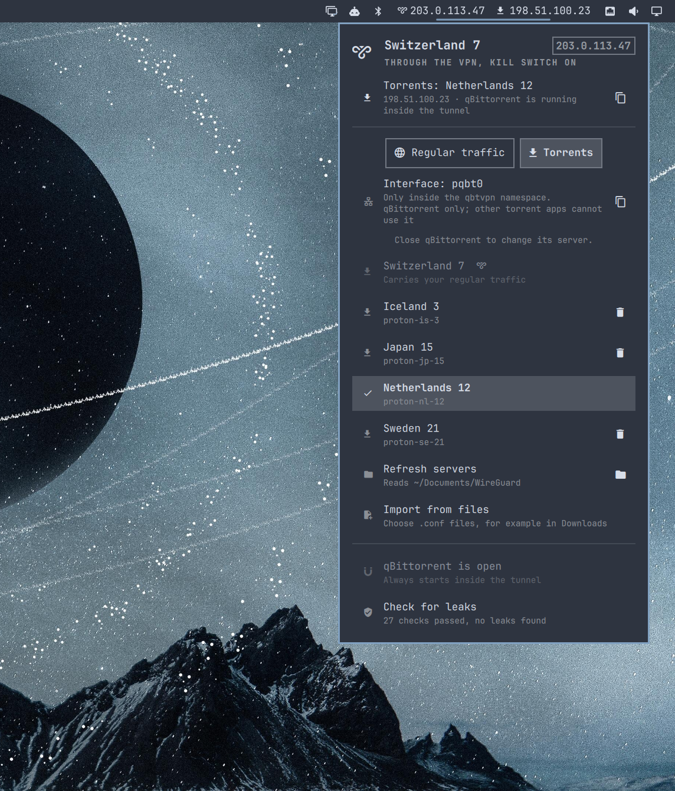

# omarchy-proton

Proton VPN for the [Omarchy](https://omarchy.org/) bar over WireGuard, with a kill switch, and
a second always-on tunnel that qBittorrent cannot leave.

> Unofficial. This is a community plugin, not affiliated with or endorsed by Proton AG. It
> uses the standard WireGuard configs you download from your own Proton VPN account.

**Install:** open a terminal (<kbd>Super</kbd> + <kbd>Return</kbd>), paste this line, and
press Enter.

```sh
omarchy plugin add https://github.com/ralphk-86/omarchy-proton.git --enable && ~/.config/omarchy/plugins/io.github.ralphk-86.omarchy-proton/install.sh
```

The first half adds the widget to your bar; Omarchy asks you to confirm and where to put it.
The second half sets up the system part: it installs any missing packages from the official
repositories and asks for your password once. It does not connect anything. Then
[add your servers](#add-servers).

Rather read the code before anything runs as root? Run only the first half. The widget then
shows a wrench, and **Finish setup** in its panel does the second half when you are ready.
Details: [Install](#install).

<p>
  
  
</p>

<sub>Screenshots use made-up servers and addresses from the ranges reserved for documentation.</sub>

**Contents:** [Quick start](#quick-start) · [What you choose](#what-you-choose) ·
[How to use it](#how-to-use-it) · [Requirements](#requirements) · [Install](#install) ·
[Add servers](#add-servers) · [How the protection works](#how-the-protection-works) ·
[Check it, and get out of trouble](#check-it-and-get-out-of-trouble) ·
[Using it with Tailscale](#using-it-with-tailscale) · [Settings](#settings) ·
[What gets installed](#what-gets-installed) · [Update](#update) · [Uninstall](#uninstall) ·
[Security and privacy](#security-and-privacy) · [Limits](#limits) ·
[Development and tests](#development-and-tests)

## Quick start

1. Paste the install line from the top of this page into a terminal and type your password
   when asked. Missing packages are installed for you. (If you added only the widget: click
   the wrench in the bar and choose **Finish setup**.)
2. Download at least two WireGuard configs from account.protonvpn.com (Downloads > WireGuard
   configuration, platform GNU/Linux): one for your regular traffic, one for torrents.
3. Import them. Either put them all in `~/Documents/WireGuard` and choose **Refresh servers**
   (easiest for several), or choose **Import from files** and pick them wherever they are.
4. On the **Regular traffic** tab pick a server; the kill switch turns on with it. On the
   **Torrents** tab pick the server for qBittorrent. **Normal connection** turns the VPN off.
5. Choose **Check for leaks** once. It should say that every check passed.

Details for each step follow below.

## What you choose

Your regular traffic (browser, apps, everything except qBittorrent) goes out one of two ways,
and you pick which in the panel:

- **Normal connection:** your own IP address, no VPN. This is the default, and what you get
  after a reboot.
- **A Proton server:** the server's IP address. Websites see Proton, not you.

**The kill switch is always on while a server is selected.** There is no setting to turn it off:
if the server stops answering, the connection drops, or the machine wakes from sleep before the
VPN is back, your regular traffic is blocked (and you get a notification) instead of going out
through your own address. Choosing **Normal connection** is the only way out of it, and it is
also what a reboot gives you.

The bar always shows which IP your regular traffic is using right now. Torrents are separate:
qBittorrent always uses its own tunnel, whatever you pick for regular traffic, and the bar
shows that IP too.

Two tunnels, on purpose:

| | Desktop VPN | Torrent tunnel |
|---|---|---|
| What goes through it | everything you do, when you pick a server | qBittorrent, always |
| Default | off: you are on your normal connection | on from boot |
| You control it | from the bar panel | you don't; it is never toggled |
| If it fails | kill switch: traffic is blocked until you pick a server or "Normal connection" | qBittorrent has no network at all |

Most setups use one VPN for both jobs, and they conflict: you want to switch the browsing VPN
on and off freely, and you never want torrents to be off it. Here they are independent.
Turning the desktop VPN off, or switching server, does not touch the torrent tunnel.

Built for and tested with Proton VPN. It only relies on standard WireGuard `.conf` files, so
other providers (Mullvad, IVPN, AirVPN, Windscribe, self-hosted) work too; set
`VPNKIT_PROVIDER` for their naming.

## How to use it

**The bar** shows two addresses: the external IP of your regular traffic (a globe when that is
your own, a VPN mark when it is a server's) and, after the download arrow, the exit IP of the
torrent tunnel. It turns the urgent colour when traffic is blocked by the kill switch, when the
torrent tunnel is down, or when a VPN is up without its kill switch, and flashes
`TORRENT LEAK` if a qBittorrent process is ever found outside its tunnel.
Left-click opens the panel, right-click toggles the VPN, middle-click refreshes.

**The panel**, top to bottom:

| Part | What it does |
|---|---|
| Header | where your regular traffic goes right now, and its IP; "kill switch on" with a server |
| Torrents line | the torrent server, its IP, and whether qBittorrent is running inside the tunnel; the copy icon copies the IP |
| **Regular traffic / Torrents** | which traffic the list below chooses a server for |
| Normal connection | (Regular traffic tab) your own IP, no VPN; removes the kill switch |
| One row per server | click to use it for the tab you are on; a tick marks the current one. The server the other tab uses is greyed and labelled. The trash icon deletes a server (click twice) |
| Refresh servers | imports every config waiting in `~/Documents/WireGuard`; the folder icon opens that folder |
| Import from files | opens the standard file dialog; pick one or more `.conf` files from any folder |
| Open qBittorrent | starts it inside the tunnel (it refuses when the tunnel is down) |
| Check for leaks | runs about thirty checks on the live system and shows the result; any failing check is listed in red underneath |
| Troubleshoot with AI | appears only when something is wrong (a failed check, a dropped VPN, the torrent tunnel down); see below |

**Notifications** appear when the VPN drops and the kill switch starts blocking, when the
torrent tunnel goes down, if a qBittorrent process is ever found outside its tunnel, and when
a leak check fails. The critical ones get through Do Not Disturb.

### When something is wrong: troubleshoot with AI

This works like Omarchy's own "Process crashed, click to diagnose with AI". If you have chosen
an AI coding agent in Omarchy (menu, **Setup**, **Defaults**, **Agent**, or
`omarchy default agent <name>`), the problem notifications say *Click to troubleshoot with AI*,
and the panel shows a **Troubleshoot with AI** row. Either one opens your agent in a terminal
with what went wrong, the current `vpn-status`, and the failing lines of the last leak check.
It also points the agent at a skill file shipped with the plugin
(`/usr/local/lib/vpnkit/skills/diagnose-vpn/SKILL.md`) that explains how the two tunnels and
the kill switch work, and sets the rules:

- it diagnoses first and **asks before changing anything**;
- it never prints a private key, and never turns the kill switch off, opens the firewall or
  re-enables IPv6 to make an error go away;
- `vpn-rescue` is offered only as a last resort, with its cost stated (your real IP for
  regular traffic).

No agent chosen? The notifications stay plain and the panel row offers the agent picker. Run
it by hand any time with `vpn-diagnose "what you saw"`. The agent is whichever one you use
(Claude Code, Codex, OpenCode, ...), so what you send it (including your external IPs and
server names, never your keys) is governed by that agent's own privacy terms; nothing is sent
until you click. Omarchy starts agents in their unattended mode, so the skill's rules guide
the agent rather than sandbox it; see [SECURITY.md](SECURITY.md).

**Keyboard**, while the panel is open: `j`/`k` or up/down move, `enter` picks, left/right or `t`
switch between the two tabs, `r` refreshes servers, `o` normal connection, `x` deletes the
selected server (twice), `v` checks for leaks, `a` troubleshoots with AI (when shown), `c`
copies your IP, `esc` closes.

## Requirements

- Omarchy 4 or newer (the Quickshell-based shell), with NetworkManager in charge of the network,
  which is the Omarchy default.
- Packages: `networkmanager`, `nftables`, `jq` and `curl` are part of a stock Omarchy.
  `wireguard-tools` is not; **setup installs it for you** from the official repositories
  (`pacman -S --needed`), along with any of the others that are missing. Nothing comes from the
  AUR and nothing is downloaded from anywhere else.
- `qbittorrent` is optional and is not installed for you. If you want the torrent tunnel:
  `omarchy pkg add qbittorrent`.
- A VPN account that gives you WireGuard configuration files.

## Install

Installing takes two steps. Omarchy's plugin installer never runs anything as root, so the
system part (the kill switch, the torrent namespace and a handful of commands in
`/usr/local/bin`) is a separate, visible step, the same pattern Omarchy's own plugins use.

**Both at once**, in a terminal, as your normal user (not with `sudo`):

```sh
omarchy plugin add https://github.com/ralphk-86/omarchy-proton.git --enable && ~/.config/omarchy/plugins/io.github.ralphk-86.omarchy-proton/install.sh
```

**Or one at a time.** First the widget:

```sh
omarchy plugin add https://github.com/ralphk-86/omarchy-proton.git --enable
```

It appears on the right of the bar showing a wrench. Open it and choose **Finish setup**. An
Omarchy terminal opens, installs any missing packages, asks for your password once, and
installs the system part. That button runs the same command as the second half of the line
above:

```sh
~/.config/omarchy/plugins/io.github.ralphk-86.omarchy-proton/install.sh
```

The Omarchy plugin marketplace lists this plugin as *Manual setup*, because of this second
step, so it shows no install button there; use the line above.

Setup does not connect anything and does not change your normal route or DNS. It checks that
the internet answers before and after, and undoes its network changes if it stopped.

Setup changes these things outside the plugin folder, and nothing else:

- installs missing packages (see Requirements) and the files listed under
  [What gets installed](#what-gets-installed)
- turns IPv6 off: a sysctl file, and `ipv6.method=disabled` on your wired and Wi-Fi
  NetworkManager profiles. Skip this with `install.sh --keep-ipv6`; undo it with
  `uninstall.sh --restore-ipv6`
- adds a launcher entry for qBittorrent in `~/.local/share/applications` (an existing one is
  backed up next to it)

It never edits your existing configuration files. The recommended qBittorrent settings are
applied only if you ask: `install.sh --qbt-config` (a backup of `qBittorrent.conf` is kept).

Read the scripts before you run them; a plugin that asks for root deserves that.

## Add servers

**Get configs.** In your Proton account: account.protonvpn.com > Downloads > WireGuard
configuration > platform **GNU/Linux** > pick a server > Create. Each download is one config
and uses one of your plan's connections. Download as many as you want servers to switch
between; you need at least two to use the torrent tunnel and a VPN for regular traffic at the
same time.

**Import them**, either way:

- **Drop folder (easiest for several):** put all the `.conf` files in `~/Documents/WireGuard`
  (the folder icon on the **Refresh servers** row opens it), then choose **Refresh servers**.
  When configs are waiting the row reads **Import N new configs**. From a terminal:
  `vpn-import`.
- **Import from files:** choose **Import from files** and pick one or more configs wherever
  they are, for example straight from `~/Downloads`. From a terminal: `vpn-import <files>`.

Each config becomes a server named after its location (`# SE#21` inside a Proton config becomes
"Sweden 21"; other files are named after the file). Imported files are **moved out of the
folder they were in**: a config contains a private key and should not sit in Documents or
Downloads, where backup and sync tools copy things. The installed copies are readable by root
only.

To delete a server, click the trash icon on its row twice, or press `x` twice. A server in use
on either tab cannot be deleted.

### The torrent tunnel

Every server you import can carry either your regular traffic or torrents. Switch to the
**Torrents** tab and pick one; close qBittorrent first, because the tunnel is rebuilt under it.
A config put into `~/Documents/WireGuard/torrent/` is imported like the others and chosen for
torrents straight away, which is handy the first time. For Proton, pick servers marked P2P.

**One server cannot do both at the same time.** A config is one key, and Proton (like most
providers) drops both connections when one key is used twice. So you need at least two
configs, and the panel greys out, for regular traffic, the server that carries torrents, and
the other way round. Two configs of the *same* Proton server are fine: each download has its
own key.

From then on `qbittorrent` (the command, the launcher entry and magnet links) always starts
inside the tunnel, or refuses to start. To move the torrent tunnel to another server, choose it
under **Torrents** in the panel (or `sudo vpnkit-sync torrent <server>`).

If you never add a torrent config, the desktop VPN works on its own. qBittorrent then refuses
to start, because this kit's promise is that it never runs outside a tunnel.

### Which network interface is which

| Interface | Where it exists | Carries |
|---|---|---|
| `pqbt0` | only inside the `qbtvpn` network namespace | torrents: qBittorrent, and nothing else |
| `proton-<server>` (e.g. `proton-se-21`) | on your desktop, while a server is picked | regular traffic |
| your ethernet / Wi-Fi (`enp…`, `wlp…`) | on your desktop | regular traffic on Normal connection (your own IP) |

- **In qBittorrent**, *Tools, Options, Advanced, Network interface* should be `pqbt0` or
  *Any interface*. Both are safe: inside the namespace `pqbt0` is the only way out. Any other
  interface simply does not exist in there, so qBittorrent would not connect at all (the leak
  check warns about this). `install.sh --qbt-config` sets `pqbt0` for you.
- **Other torrent apps** (Transmission, Deluge, qbittorrent-nox, rTorrent, KTorrent,
  Fragments, ...) are not covered. Only `qbittorrent` is started inside the namespace, and
  `pqbt0` cannot be seen or chosen from the desktop. Such an app uses your regular connection:
  your own IP on Normal connection, or the regular server while one is picked. Do not "fix"
  that by binding it to a `proton-*` interface: that is the regular tunnel, and it drops
  whenever you switch servers. Use qBittorrent. If one of these apps is found running, the
  panel and bar warn you and the leak check fails.

The names above are the defaults; `WG_IF`, `NS` and the provider prefix can be changed in
`/etc/vpnkit/vpnkit.conf`. `vpn-status --json` shows the ones in use (`torrent_if`,
`torrent_ns`, `prefix`).

## How the protection works

**Kill switch.** Picking a server loads an nftables table that rejects everything leaving the
machine unless it goes out through a VPN interface, is WireGuard's own encrypted traffic, or
stays on your local network. DNS is rejected outside a tunnel even towards your router. It is
loaded *before* the old connection is dropped, so switching servers has no open moment. Only
**Normal connection** (`vpn-toggle off`) removes it. A server that stops answering, a profile
NetworkManager drops, or waking from suspend therefore leaves you blocked, with the bar
saying so, never silently on your own IP. A NetworkManager hook arms the switch even when a
server is started from somewhere else, and reconnects the server you picked after resume.

The kill switch has no off setting: whenever a server is selected, it is on. It lives in the
kernel, not on disk, so after a reboot you are on the normal connection, by design: the
default state of this machine is "no VPN".

**Torrent namespace.** A network namespace has its own interfaces, routes and resolver. The
one for qBittorrent contains a loopback and the WireGuard interface, nothing else. There is
no other path to fall back to, so nothing has to be filtered in time. Three details make that
hold:

| Hole | What closes it |
|---|---|
| `systemd-resolved` answers over a Unix socket, which a network namespace does not isolate | the namespace gets its own `nsswitch.conf` without the `resolve` and `mdns` modules, so lookups go to the in-tunnel resolver |
| IPv6 around an IPv4-only tunnel | IPv6 is disabled inside the namespace, and by default on the host |
| qBittorrent started by hand | `/usr/local/bin/qbittorrent` comes first in `PATH`, enters the namespace, and refuses when the tunnel is down |

The status you see is measured, not inferred: a running qBittorrent is reported as protected
only when the inode of `/proc/<pid>/ns/net` equals the namespace's, and the torrent exit IP is
fetched from inside the namespace. If a qBittorrent process is ever found outside, the bar
flashes `TORRENT LEAK`.

**IPv6** is switched off on real interfaces (loopback keeps `::1`), because the tunnels carry
IPv4 only. To keep IPv6 while no VPN is selected, install with `install.sh --keep-ipv6`; the
kill switch still blocks it whenever a server is picked.

## Check it, and get out of trouble

```sh
vpn-status                  # both tunnels, both external IPs
vpn-verify                  # the leak checks (same as the panel row)
sudo vpn-verify --fail-closed   # also pulls each tunnel down and proves nothing gets out
vpn-rescue                  # way back: VPN off, kill switch off, confirms the internet works
vpn-diagnose "what you saw" # hand the problem to your AI agent (see above)
```

`vpn-rescue` needs no network to run. A reboot does the same. Independent checks worth doing
once: ipleak.net and dnsleaktest.com in the browser with a server picked, and ipleak.net's
"torrent address detection" magnet in qBittorrent.

## Using it with Tailscale

Tailscale keeps working with a server selected: the kill switch lets traffic through the
`tailscale0` interface and Tailscale's own encrypted packets, and Tailscale installs routing
rules that take precedence over the VPN's. Nothing to configure. If a Tailscale machine does
not answer while a server is selected, check with `vpn-toggle off` whether it answers without
the VPN; if it does, please open an issue.

## Settings

Widget settings (Omarchy's plugin settings): refresh interval, show IPs in the bar.

Everything else is in `/etc/vpnkit/vpnkit.conf`, which the installer never overwrites:

| Setting | Default | Meaning |
|---|---|---|
| `CONFIG_DIR` | `~/Documents/WireGuard` | the drop folder |
| `BYPASS_CIDRS` | empty | addresses that keep using your normal connection while a VPN is up, for example a server whose SSH is firewalled to your home IP. Applied to servers imported afterwards |
| `KILLSWITCH_ALLOW_LAN` | `1` | keep the local network reachable while the kill switch is on |
| `DISABLE_IPV6` | `1` | see above |
| `VPNKIT_PROVIDER` | `proton` | naming preset; `generic`, `mullvad`, `ivpn`, `airvpn`, `windscribe` for other providers |

## What gets installed

The engine underneath is called `vpnkit`; that is the name you will see in paths.

| Path | What |
|---|---|
| `/usr/local/bin/vpn-*`, `vpnkit-*`, `qbt-*`, `qbittorrent` | the commands and helpers |
| `/usr/local/lib/vpnkit/` | shared library, version, a copy of the uninstaller, the `diagnose-vpn` skill for AI troubleshooting |
| `/etc/vpnkit/` | settings (no secrets) |
| `/etc/sudoers.d/99-vpnkit` | passwordless rules for five specific helpers, validated with `visudo -c` before install |
| `/etc/NetworkManager/dispatcher.d/50-vpnkit` | arms the kill switch, reconnects after resume |
| `/etc/systemd/system/qbt-netns.service` | builds the torrent namespace at boot |
| `/etc/sysctl.d/99-vpnkit-disable-ipv6.conf` | IPv6 off (unless `--keep-ipv6`) |
| `/etc/wireguard/`, `/etc/NetworkManager/system-connections/` | your imported configs, mode 0600, root |
| `~/.local/share/applications/org.qbittorrent.qBittorrent.desktop` | launcher pointing at the wrapper |
| `~/.config/qBittorrent/qBittorrent.conf` | only with `install.sh --qbt-config`: merged with `qbittorrent/qBittorrent.conf.template` (backup kept): bind to the tunnel interface, anonymous mode, require encryption, no UPnP, no local discovery |

The passwordless helpers are written to be safe to grant: they take no paths from the caller,
validate every argument, the launcher drops to your user before starting qBittorrent, and the
status helper only reads.

## Update

```sh
omarchy plugin update io.github.ralphk-86.omarchy-proton
```

updates the widget. After every new version the panel shows **Update the system part**; click
it (one password prompt). It is safe to run again when only the widget or the documentation
changed.

If the widget still looks like the old version after an update, run `omarchy restart shell`:
the shell does not always reload a plugin's code in place.

## Uninstall

Two steps, in this order: first the system part, then the widget.

```sh
~/.config/omarchy/plugins/io.github.ralphk-86.omarchy-proton/uninstall.sh          # keeps servers, configs, settings
~/.config/omarchy/plugins/io.github.ralphk-86.omarchy-proton/uninstall.sh --purge  # removes those too
~/.config/omarchy/plugins/io.github.ralphk-86.omarchy-proton/uninstall.sh --restore-ipv6
omarchy plugin remove io.github.ralphk-86.omarchy-proton
```

The uninstaller switches to the normal connection, removes the kill switch, the torrent
namespace and every file from the table above. Without `--purge` it keeps your servers, the
torrent config and `/etc/vpnkit/vpnkit.conf`, so a later reinstall picks up where you left off.
IPv6 stays off unless you pass `--restore-ipv6`. qBittorrent is no longer confined afterwards.

If you removed the plugin folder first, the system part can still be removed:
`sudo bash /usr/local/lib/vpnkit/uninstall-root.sh` (same options).

## Security and privacy

- **Network requests of its own:** one. The bar looks up your external IP at `ifconfig.me`
  (every 30 seconds while the widget polls, cached, configurable with `IP_LOOKUP_URL`). What
  comes back is read with a time limit and a 256-byte size cap, so a broken or hostile lookup
  server cannot flood a helper. There is no telemetry and nothing else is contacted, apart
  from `pacman` installing packages during setup. *Troubleshoot with AI* starts your own AI agent only when you click it.
- **Keys:** your configs contain private keys. They are removed from the drop folder once
  imported and kept only in root-owned files with mode 0600.
- **Root:** setup and uninstall run as root once, when you enter your password. Five
  purpose-built helpers may be run by your user without a password; each takes no paths and
  validates its arguments. The full list, and how to report a vulnerability, is in
  [SECURITY.md](SECURITY.md).
- **Trust:** Omarchy plugins run unsandboxed inside the shell, and this one installs root
  helpers. Read `install.sh`, `system/install-root.sh` and `system/bin/` before you run setup.

## Limits

- The kill switch protects against accidents, not against you or software running as you:
  anything that can run `vpn-toggle off` turns it off, and a reboot clears it.
- While a VPN is selected, other VPNs on the machine that do not belong to this kit are
  blocked by the kill switch. Tailscale is allowed.
- The local network stays reachable with the kill switch on (change with
  `KILLSWITCH_ALLOW_LAN=0`).
- No port forwarding for torrents; downloads work, you are just not connectable from outside.
- Only qBittorrent is confined. Other torrent clients (Transmission, Deluge, a browser
  extension) run on the normal connection or the desktop VPN like any other program.
- WireGuard through NetworkManager only. No OpenVPN.
- Switching servers uses NetworkManager's normal permissions: fine from your desktop session;
  from an SSH session NetworkManager (polkit) may refuse, and then the kill switch keeps you
  blocked until you switch from the desktop or run `vpn-toggle off`.
- The external IP shown in the bar comes from `ifconfig.me` (configurable). That is one small
  request every 30 seconds to a third party.
- Plugins run unsandboxed inside the Omarchy shell, and this one also installs root helpers.
  Read the code.

## Development and tests

```sh
tests/check.sh              # static checks: syntax, versions, sudoers, manifest, no personal data
tests/marketplace-scan.sh <marketplace checkout>   # the marketplace's own security scan
tests/vm/vm.sh prepare      # build an Omarchy test VM once (QEMU, no root needed)
tests/vm/vm.sh test         # install, import, kill switch, leaks, uninstall: in the VM
```

The VM suite simulates the internet and a VPN provider inside the VM, so it needs no account
and never touches the machine it runs on. See [CONTRIBUTING.md](CONTRIBUTING.md).

The design and most of the scripts come from a Fedora/KDE predecessor by the same author.

## License

MIT, see [LICENSE](LICENSE). "Proton" and "Proton VPN" are trademarks of Proton AG; this plugin
is an independent project and is not affiliated with or endorsed by Proton.
